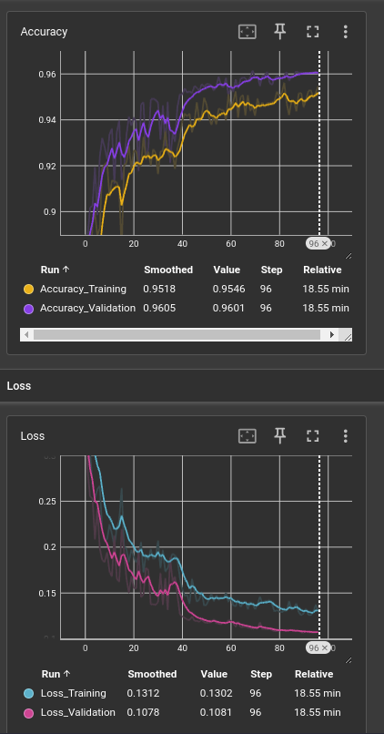
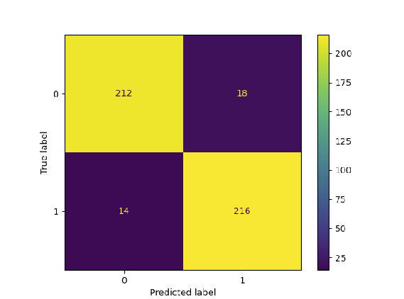
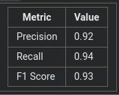

# car-damage-detection

This repository provides a reproducible, automated pipeline for training a deep learning model on the [car damage detection dataset](https://www.kaggle.com/datasets/anujms/car-damage-detection/data). The pipeline includes stages for data processing, model training, and evaluation. It uses [Prefect](https://www.prefect.io/) for task orchestration.

## Table of Contents

- [car-damage-detection](#car-damage-detection)
  - [Table of Contents](#table-of-contents)
  - [Project Structure](#project-structure)
  - [Pipeline Structure](#pipeline-structure)
  - [Setup and Installation](#setup-and-installation)
    - [Requirements](#requirements)
    - [Installation](#installation)
    - [Pre-commit linting](#pre-commit-linting)
  - [Usage](#usage)
    - [Running the Pipeline](#running-the-pipeline)
  - [Configuration](#configuration)
  - [Example results](#example-results)
    - [Training and validation loss and accuracy](#training-and-validation-loss-and-accuracy)
    - [Confusion matrix on test set](#confusion-matrix-on-test-set)
    - [Precision, Recall, and F1 Score on test set](#precision-recall-and-f1-score-on-test-set)


## Project Structure

```
car-damage-detection
├─ .gitignore
├─ .pre-commit-config.yaml  # Runs `ruff format` and `ruff check` on all modified files before each commit
├─ LICENSE
├─ README.md
├─ config.yml               # Configuration file for pipeline parameters
├─ data                     # Car damage detection dataset
│  ├─ __init__.py
│  ├─ dataset.py
│  └─ datasets
│     ├─ __init__.py
│     └─ car_damage
│        ├─ __init__.py
│        ├─ test
│        │  ├─ damaged
│        │  │  ├─ 0001.JPEG
│        │  │  ├─ 0002.JPEG
│        │  │  ├─ 0005.JPEG
│        │  │  ├─ ...
│        │  │  ├─ 0006.JPEG
│        │  │  └─ 0230.JPEG
│        │  └─ whole
│        │     ├─ 0001.jpg
│        │     ├─ 0002.jpg
│        │     ├─ 0003.jpg
│        │     ├─ ...
│        │     └─ 0230.JPEG
│        └─ train
│           ├─ damaged
│           │  ├─ 0001.JPEG
│           │  ├─ 0002.JPEG
│           │  ├─ 0003.JPEG
│           │  ├─ ...
│           │  ├─ 0919.JPEG
│           │  └─ 0920.jpeg
│           └─ whole
│              ├─ 0001.jpg
│              ├─ 0002.jpg
│              ├─ 0003.jpg
│              ├─ ...
│              ├─ 0919.JPEG
│              └─ 0920.JPEG
├─ environment.yml          # Conda environment definition
├─ main.py                  # Orchestrates the pipeline using Prefect
├─ scripts
│  ├─ evaluate_model.py     # Model evaluation script                   
│  ├─ process_data.py       # Data processing script
│  └─ train_model.py        # Model training script
├─ training_logs            # Training logs for tensorboard and model checkpoints
├─ transforms
│  ├─ __init__.py
│  └─ transforms.py         # Data transforms used for processing
└─ utils
   ├─ __init__.py
   ├─ constants.py
   └─ utils.py
```

## Pipeline Structure

The pipeline consists of the following main components:

1. **`process_data.py`**: Preprocesses and splits the dataset into training and validation sets. Outputs are passed in memory to the next stage (for increased robustness, they should be serialized to disk).
2. **`train_model.py`**: Loads the processed data and fine-tunes a pre-trained deep learning model (e.g. ResNet18) on it, saving model checkpoints and logging results to tensorboard.
3. **`evaluate_model.py`**: Evaluates the trained model on a held-out test set, reporting accuracy, recall, precision, and f1 score.
4. **`main.py`**: Orchestrates the full pipeline using Prefect, allowing tasks to be run in sequence with proper dependency management.

Training and evaluation can be monitored with tensorboard.

## Setup and Installation

### Requirements

- Python 3.8+
- [Conda](https://docs.conda.io/en/latest/) for managing the environment
- See `environment.yml` for all dependencies

### Installation

1. Clone the repository:
   ```bash
   git clone https://github.com/CGranstrom/car-damage-detection.git
   cd car-damage-detection
   ```

2. Set up the environment:
   ```bash
   conda env create -f environment.yml
   conda activate car-damage-env
   ```

3. Update any paths or parameters in `config.yml` as needed (see [Configuration](#configuration) section).

### Pre-commit linting

The `.pre-commit-config.yaml` file defines a pre-commit hook to run `ruff format` and `ruff check` on all modified files before each commit. To install this hook, run `pre-commit install`.

## Usage

### Running the Pipeline

To run the pipeline, execute the main script:

```bash
python main.py
```

This will execute the data processing, model training, and evaluation tasks in sequence. Logs and metrics will be displayed in the console. To view plots of the accuracy and loss during training, in a terminal, activate the conda environment and run tensorboard:

```bash
cd car-damage-detection
conda activate car-damage-detection
tensorboard --logdir="training_logs/<directory name you set for 'run_name' in config.yml>"
```

## Configuration

The pipeline is configurable through the `config.yml` file, which allows you to set parameters for each stage.

## Example results

Below are screenshots of results output to tensorboard. See `training_logs/example_run` for files.

### Training and validation loss and accuracy


### Confusion matrix on test set


### Precision, Recall, and F1 Score on test set

